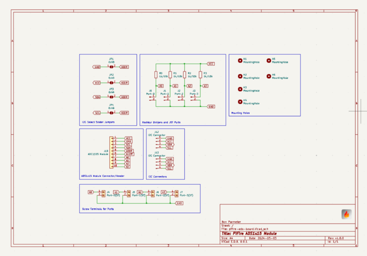
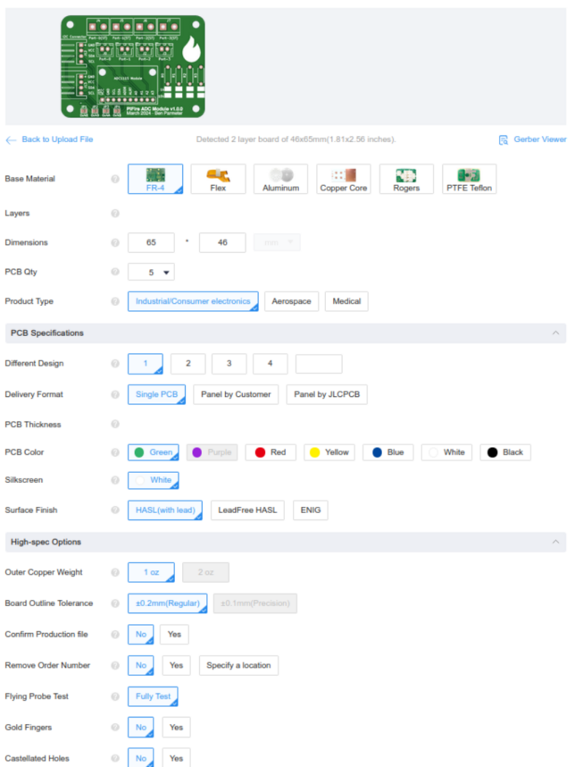

# PiFire ADS1x15 Module PCB KiCad Files

## What is this? 

This PCB provides an easy way to add an ADS1x15 module to your PiFire build.  This allows you to have up to four different modules in your system, and can be chained together via I2C.  Use the solder jumpers to select a unique I2C address for each of the modules in your system (default is 0x48).  The PCB provides options for JST XH connectors or screw terminals (or if you want to solder wires directly to the board you can always do that too).  Lastly, there are boxes where you can designate the value of the populated resistors, for easy reference once you've built it out.  

The design intent for this board was to make a DIY accessible PCB that can be more easily put together by the maker/enthusiast of almost any skill level.  Full size components are used in most cases and most (if not all) parts should be readily available to order online.  See the [Interactive BOM](#interactive-bom) for more details about the parts used and links to order.

### What is PiFire? 

PiFire is a SBC based Pellet Smoker Controller.  More details can be found [here](https://nebhead.github.io/PiFire) or [at the GitHub repo](https://github.com/nebhead/pifire). 

## What's in this Repository?

### KiCad Project Files 
In this repository you will find the latest KiCad design files for the  PCB.  Simply load the project file (.kicad_pro) into the KiCad software and you should be able to edit as needed.  Or if you just want to get this board made, jump to the production section below.

### Interactive BOM

There is an interactive BOM located in the [/bom](bom/) folder which details the parts and provides some pin information as well.  Use this to gather the components you may need to build this board out and refer back to it for placement help.    

[BOM + Pin Info](https://nebhead.github.io/pifire-ads-board)

_This is a standalone HTML file that was autogenerated by the excellent plugin for KiCad. See the plugin here: [https://github.com/openscopeproject/InteractiveHtmlBom](https://github.com/openscopeproject/InteractiveHtmlBom)_

### PDF of the Schematic

Preview the schematic in PDF format here: [Schematic](pifire-ads-board-schematic.pdf)

### PCB Specific Notes

#### Mounting ADS1115 Device

This intention of this PCB is to have a ADS1115 (or ADS1015) mounted to the top of this board.  You can attach this with a standard pin-header, or directly attaching with solder only.  (see the diagram below showing the ADS1115 attached in the yellow dotted line area)

#### Selecting I2C Address

In addition, you may be able to have up to four of these boards in a single system by assigning different I2C addresses to each device.  These addresses can be selected by using the solder jumpers provided at the bottom of the board.  Simply select the address you want and close/short the solder jumper for that address.  

### JLCPCB Production Files

If you wish to get these PCBs made by JLCPCB, the production files are provided in the `/production` folder.  For convenience, the file `pifire-ads-board-production.zip` can simply be uploaded to JLCPCB to make it super easy to order boards.

Drop the zip file onto the order page, wait for it to upload then simply continue to order the board.  Optionally, select different board color, PCB quantity, surface finish, etc.  Most of the default settings should be sufficient. 

### Links to the PCBs in this family of PiFire Boards

This PCB is part of a family of PCBs that can be used together to create  a full PiFire system.  Generally speaking you need the Main Module/Board, a Relay Control Board and a Probe Device board to have a basic PiFire system.  

**Main Module/Board** (required)
* [Main Board v4.0.x](https://github.com/nebhead/pifire-main-module-nopwr)

**Relay/Fan Control Boards** (choose one)
* [Mechanical Relay Module](https://github.com/nebhead/pifire-relay-module)
* [Solid State Relay Module](https://github.com/nebhead/pifire-relay-module-SSR)
* [Solid State Relay + PWM Fan Module](https://github.com/nebhead/pifire-relay-pwm-module-SSR) - Coming Soon! 

**Probe Device Board** (optional)
* [ADS Board](https://github.com/nebhead/pifire-ads-board) 

### 3D Printable Enclosures/Boxes 

With all of the 3D Prints for PiFire, a higher temperature filament such as PETG should be used.  PLA generally won't stand up to the temperatures that the components may be exposed to outdoors and near a hot smoker.  

#### Enclosure

Included here is an initial revision of the enclosure for this PCB.  The current models should be considered still in development and may have alignment challenges, etc. 

Except for the mounting wings, the majority of bolts to be used with this enclosure are M3. 

* STL: [Base](/printables/PiFire-PCB-v4-ADS-Base.stl)
* STL: [Lid](/printables/PiFire-PCB-v4-ADS-Lid.stl)
* OnShape: [Enclosure Original Models](https://cad.onshape.com/documents/06ff4784dfd59b5ba448a771/w/ff8c53d96188935699d945ec/e/67f72d5e3136186b90fce856?renderMode=0&uiState=66e1183808b48b5751063bbb)